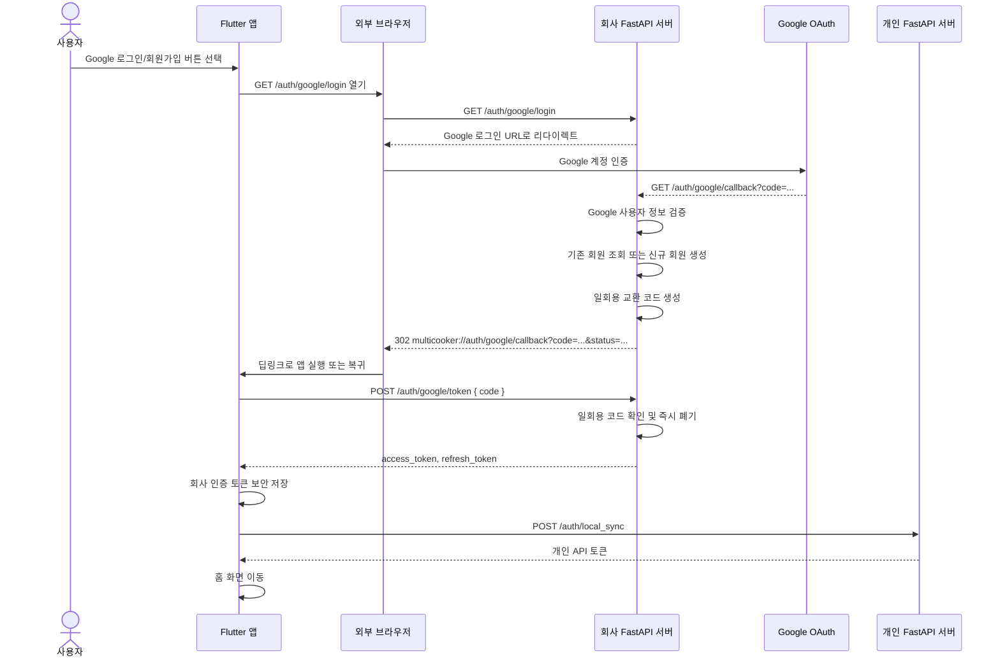

# Google 로그인/회원가입 연동 구현 문서

> 작성 기준: 2026-07-13에 확인한 Flutter 앱과 FastAPI 인증 서버 코드
>
> 이 문서는 Google OAuth 로그인 시작부터 앱 복귀, JWT 발급, 토큰 저장까지의 전체 흐름과 관련 코드 위치를 설명합니다.

---

## 1. 구현 목적

앱에서 사용자가 **Google로 로그인** 또는 **Google로 회원가입** 버튼을 누르면 다음 작업을 수행합니다.

1. Flutter 앱이 회사 인증 서버의 Google 로그인 시작 주소를 외부 브라우저로 엽니다.
2. 회사 인증 서버가 사용자를 Google 계정 인증 화면으로 이동시킵니다.
3. Google 인증 완료 후 Google이 회사 서버의 callback 주소로 사용자를 돌려보냅니다.
4. 회사 서버가 Google 사용자 정보를 검증합니다.
5. 기존 Google 회원이면 로그인 처리하고, 처음 사용하는 Google 계정이면 회원을 자동 생성합니다.
6. 회사 서버가 짧은 수명의 일회용 교환 코드를 발급합니다.
7. 회사 서버가 `multicooker://` 딥링크로 Flutter 앱을 다시 실행합니다.
8. Flutter 앱이 일회용 코드를 회사 서버의 `/auth/google/token`으로 전송합니다.
9. 회사 서버가 access token과 refresh token을 발급합니다.
10. Flutter 앱이 토큰을 보안 저장소에 저장하고 로그인 상태를 완료합니다.
11. 필요한 경우 회사 계정을 개인 FastAPI 서버 사용자와 동기화합니다.

이 구조에서는 **Google의 OAuth 인증 코드나 JWT를 딥링크 URL에 직접 넣지 않습니다.** 앱 딥링크에는 회사 서버가 생성한 짧은 수명의 일회용 코드만 전달됩니다.

---

## 2. 프로젝트 구성

Google 인증은 Flutter 앱과 FastAPI 회사 서버에 나뉘어 구현되어 있습니다.

### Flutter 앱

```text
GrapheneSquare_cooker_app-master/
```

담당 기능:

- Google 버튼 표시
- 외부 브라우저 실행
- `multicooker://` 딥링크 등록
- 딥링크 수신 및 파라미터 해석
- 일회용 코드를 JWT로 교환
- access token 및 refresh token 저장
- 로그인 완료 후 홈 화면 이동
- 개인 FastAPI 서버와 사용자 동기화

### 회사 인증 서버

```text
MultiCookerServer-main/
```

담당 기능:

- Google OAuth 로그인 URL 생성
- Google callback 처리
- Google 사용자 정보 검증
- 기존 회원 조회 또는 신규 회원 자동 생성
- 앱 복귀용 일회용 코드 생성
- Flutter 앱 딥링크로 리다이렉트
- 일회용 코드를 access token 및 refresh token으로 교환

---

## 3. 전체 인증 흐름



중요한 주소는 서로 역할이 다릅니다.

```text
Google 인증 완료 후 Google이 돌아오는 주소
→ 회사 서버의 GOOGLE_CALLBACK_URL
→ 예: https://auth.example.com/auth/google/callback

회사 서버가 Flutter 앱을 다시 여는 주소
→ GOOGLE_MOBILE_REDIRECT_URL
→ multicooker://auth/google/callback
```

즉, `multicooker://auth/google/callback`은 Google Cloud Console에 등록하는 Google callback 주소가 아닙니다. Google은 먼저 회사 서버로 돌아오고, 회사 서버가 다시 앱 딥링크를 실행합니다.

---

## 4. 사용되는 API와 URL

| 구분 | 메서드 | 경로 또는 URL | 역할 |
|---|---:|---|---|
| Google 로그인 시작 | GET | `/auth/google/login` | Google 로그인 페이지로 이동 |
| Google 서버 callback | GET | `/auth/google/callback` | Google 인증 결과 처리 |
| 앱 복귀 딥링크 | URL Scheme | `multicooker://auth/google/callback` | 인증 후 Flutter 앱 실행 |
| 일회용 코드 교환 | POST | `/auth/google/token` | 회사 JWT 발급 |
| 회사 사용자 조회 | GET | `/auth/me` | 로그인 사용자 정보 조회 |
| 개인 서버 동기화 | POST | `/auth/local_sync` | 개인 DB 사용자 및 개인 API 토큰 생성 |
| 테스트용 callback | GET | `/auth/google/callback/json` | 토큰 JSON 직접 반환, 현재 앱에서는 사용하지 않음 |

현재 Flutter 앱의 회사 인증 서버 기본 주소는 다음과 같습니다.

```text
http://3.36.14.110:8000
```

따라서 기본 Google 로그인 시작 주소는 다음과 같이 만들어집니다.

```text
http://3.36.14.110:8000/auth/google/login
```

배포 환경에서는 `--dart-define=AUTH_API_BASE_URL=...`로 변경할 수 있습니다.

---

# 5. Flutter 앱 구현

## 5.1 로그인 화면의 Google 버튼

파일:

```text
lib/features/auth/presentation/login_screen.dart
```

로그인 화면은 공통 Google 버튼 위젯을 사용합니다.

```dart
const GoogleAuthButton(),
```

기본 버튼 문구는 다음과 같습니다.

```text
Google로 로그인 / 회원가입
```

---

## 5.2 회원가입 화면의 Google 버튼

파일:

```text
lib/features/auth/presentation/register_email_screen.dart
```

회원가입 화면도 동일한 버튼과 동일한 OAuth 흐름을 사용합니다.

```dart
const GoogleAuthButton(label: 'Google로 회원가입'),
```

로그인 화면과 회원가입 화면의 버튼 문구는 다르지만, 두 버튼 모두 같은 주소를 엽니다.

```text
GET /auth/google/login
```

Google 로그인과 Google 회원가입을 별도 API로 나누지 않은 이유는 Google 인증 후 서버가 회원 존재 여부를 판단하기 때문입니다.

- 기존 Google 회원: `status=login`
- 처음 로그인한 Google 계정: 서버에서 회원 생성 후 `status=register`

---

## 5.3 Google 버튼 동작 및 외부 브라우저 실행

파일:

```text
lib/features/auth/presentation/widgets/google_auth_button.dart
```

핵심 함수:

```dart
Future<void> _openGoogleLogin() async {
  if (_opening) return;
  setState(() => _opening = true);

  try {
    final uri = ApiConstants.authUri(ApiConstants.googleLogin);
    final opened = await launchUrl(
      uri,
      mode: LaunchMode.externalApplication,
    );

    if (!opened && mounted) {
      _showError('구글 로그인 페이지를 열 수 없습니다.');
    }
  } catch (_) {
    if (mounted) {
      _showError('구글 로그인을 시작하지 못했습니다.');
    }
  } finally {
    if (mounted) {
      setState(() => _opening = false);
    }
  }
}
```

`LaunchMode.externalApplication`을 사용하므로 앱 내부 WebView가 아니라 Chrome, Safari 같은 외부 브라우저가 열립니다.

`_opening` 값으로 버튼 중복 실행을 막고, 브라우저를 열지 못한 경우 SnackBar 오류를 표시합니다.

필요 패키지:

```yaml
url_launcher: ^6.3.2
```

---

## 5.4 인증 서버 주소 및 API 경로

파일:

```text
lib/core/constants/api_constants.dart
```

회사 인증 서버 주소:

```dart
static const authBaseUrl = String.fromEnvironment(
  'AUTH_API_BASE_URL',
  defaultValue: 'http://3.36.14.110:8000',
);
```

Google 로그인 및 토큰 교환 경로:

```dart
static const googleLogin = '/auth/google/login';
static const googleToken = '/auth/google/token';
```

절대 URL 생성:

```dart
static Uri authUri(String path) =>
    Uri.parse(authBaseUrl).resolve(path);
```

따라서 기본 실행 주소는 다음과 같습니다.

```text
http://3.36.14.110:8000/auth/google/login
```

---

## 5.5 회사 서버용 Dio와 개인 서버용 Dio 분리

파일:

```text
lib/core/network/dio_client.dart
```

앱은 서버 목적에 따라 두 개의 Dio 인스턴스를 사용합니다.

```dart
apiDio = _createDio(ApiConstants.apiBaseUrl);
authDio = _createDio(ApiConstants.authBaseUrl);
```

| Dio 인스턴스 | 서버 | 주요 용도 |
|---|---|---|
| `authDio` | 회사 서버 | 로그인, Google 토큰 교환, `/auth/me`, 회사 레시피 API |
| `apiDio` | 개인 FastAPI 서버 | 커뮤니티, 개인 DB, AI, 디바이스, `/auth/local_sync` |

Google 일회용 코드 교환은 반드시 `authDio`를 통해 회사 서버로 요청합니다.

파일:

```text
lib/main.dart
```

의존성 연결:

```dart
final authRepository = AuthRepository(
  AuthApi(dioClient.authDio),
  LocalAuthApi(dioClient.apiDio),
  tokenStorage,
);
```

---

## 5.6 Android 딥링크 등록

파일:

```text
android/app/src/main/AndroidManifest.xml
```

등록 내용:

```xml
<activity
    android:name=".MainActivity"
    android:exported="true"
    android:launchMode="singleTask"
    ...>

    <meta-data
        android:name="flutter_deeplinking_enabled"
        android:value="false" />

    <intent-filter>
        <action android:name="android.intent.action.VIEW" />
        <category android:name="android.intent.category.DEFAULT" />
        <category android:name="android.intent.category.BROWSABLE" />
        <data
            android:scheme="multicooker"
            android:host="auth"
            android:pathPrefix="/google/callback" />
    </intent-filter>
</activity>
```

이 설정으로 Android는 다음 URL을 이 앱에 전달합니다.

```text
multicooker://auth/google/callback
```

각 부분은 다음과 대응합니다.

| 딥링크 부분 | 설정값 |
|---|---|
| scheme | `multicooker` |
| host | `auth` |
| path | `/google/callback` |

`android:launchMode="singleTask"`를 사용하므로 앱이 이미 실행 중인 경우 새 앱 인스턴스를 계속 생성하지 않고 기존 Activity로 링크를 전달할 수 있습니다.

앱에서는 `app_links` 패키지가 딥링크를 직접 처리하므로 Flutter 기본 딥링킹은 비활성화되어 있습니다.

```xml
<meta-data
    android:name="flutter_deeplinking_enabled"
    android:value="false" />
```

---

## 5.7 iOS URL Scheme 등록

파일:

```text
ios/Runner/Info.plist
```

등록 내용:

```xml
<key>FlutterDeepLinkingEnabled</key>
<false/>

<key>CFBundleURLTypes</key>
<array>
    <dict>
        <key>CFBundleTypeRole</key>
        <string>Editor</string>
        <key>CFBundleURLName</key>
        <string>com.graphenesquare.multicooker.google-auth</string>
        <key>CFBundleURLSchemes</key>
        <array>
            <string>multicooker</string>
        </array>
    </dict>
</array>
```

이 설정으로 iOS도 `multicooker://` URL Scheme을 앱으로 전달합니다.

---

## 5.8 Flutter 딥링크 수신 초기화

파일:

```text
lib/app.dart
```

사용 패키지:

```yaml
app_links: ^7.2.1
```

앱 시작 시 `initState()`에서 딥링크 처리를 초기화합니다.

```dart
@override
void initState() {
  super.initState();
  _initDeepLinks();
}
```

실행 중인 앱으로 전달되는 링크는 `uriLinkStream`으로 받습니다.

```dart
_linkSubscription = _appLinks.uriLinkStream.listen(
  _scheduleDeepLink,
  onError: (_) =>
      _showMessage('앱으로 돌아오는 링크를 처리하지 못했습니다.'),
);
```

앱이 완전히 종료된 상태에서 딥링크로 처음 실행된 경우에는 `getInitialLink()`로 받습니다.

```dart
final initialLink = await _appLinks.getInitialLink();
if (initialLink != null) {
  _scheduleDeepLink(initialLink);
}
```

따라서 다음 두 경우를 모두 처리합니다.

1. 앱이 이미 실행 중인 상태에서 브라우저로 갔다가 돌아오는 경우
2. 앱이 종료된 상태에서 딥링크로 앱이 실행되는 경우

`dispose()`에서는 스트림 구독을 해제합니다.

```dart
_linkSubscription?.cancel();
```

---

## 5.9 Google callback URL 형식 검사 및 파라미터 해석

파일:

```text
lib/features/auth/data/google_auth_callback.dart
```

허용하는 딥링크 형식:

```dart
static bool matches(Uri uri) {
  return uri.scheme.toLowerCase() == 'multicooker' &&
      uri.host.toLowerCase() == 'auth' &&
      uri.path == '/google/callback';
}
```

즉, 다음 세 값이 모두 일치해야 합니다.

```text
scheme = multicooker
host   = auth
path   = /google/callback
```

성공 URL 예시:

```text
multicooker://auth/google/callback?code=ONE_TIME_CODE&status=login
```

신규 가입 URL 예시:

```text
multicooker://auth/google/callback?code=ONE_TIME_CODE&status=register
```

실패 URL 예시:

```text
multicooker://auth/google/callback?error=google_login_failed
```

파싱하는 값:

```dart
code: uri.queryParameters['code']
error: uri.queryParameters['error']
status: uri.queryParameters['status']
```

`status` 값은 다음 enum으로 변환됩니다.

```dart
enum GoogleAuthFlowStatus {
  login,
  register,
  unknown,
}
```

---

## 5.10 앱에서 callback 처리

파일:

```text
lib/app.dart
```

핵심 함수:

```dart
Future<void> _handleDeepLink(Uri uri) async
```

처리 순서는 다음과 같습니다.

### 1단계: Google callback인지 확인

```dart
if (!GoogleAuthCallback.matches(uri)) return;
```

Google callback과 관련 없는 다른 딥링크는 무시합니다.

### 2단계: 동일 callback 중복 처리 방지

```dart
final callbackKey = uri.toString();
if (_handledGoogleCallbacks.contains(callbackKey) ||
    _googleCallbackInProgress) {
  return;
}
_handledGoogleCallbacks.add(callbackKey);
```

다음 두 값을 사용합니다.

- `_handledGoogleCallbacks`: 이미 처리한 URL 저장
- `_googleCallbackInProgress`: 현재 Google 코드 교환 작업 진행 여부

이 처리로 동일한 일회용 코드를 중복 전송하는 문제를 줄입니다.

### 3단계: 서버가 error를 전달한 경우

```dart
if (callback.hasError) {
  appRouter.go('/login');
  _showMessage(_googleErrorMessage(callback.error!));
  return;
}
```

오류 코드별 사용자 메시지:

| 서버 error | 앱 메시지 |
|---|---|
| `google_login_failed` | 구글 계정 인증에 실패했습니다. |
| `user_auth_failed` | 사용자 계정을 처리하지 못했습니다. |
| 기타 | 구글 로그인에 실패했습니다. |

### 4단계: code가 없는 경우

```dart
if (!callback.hasCode) {
  appRouter.go('/login');
  _showMessage('구글 로그인 코드가 전달되지 않았습니다.');
  return;
}
```

### 5단계: 일회용 코드로 로그인 요청

```dart
final auth = context.read<AuthProvider>();
final success = await auth.loginWithGoogleCode(callback.code!);
```

### 6단계: 성공 시 홈으로 이동

```dart
if (success) {
  appRouter.go('/home');
  _showMessage(
    callback.isRegistration
        ? '구글 계정으로 회원가입되었습니다.'
        : '구글 계정으로 로그인되었습니다.',
  );
  return;
}
```

실패하면 로그인 화면으로 돌아갑니다.

```dart
appRouter.go('/login');
_showMessage(auth.errorMessage ?? '구글 로그인에 실패했습니다.');
```

---

## 5.11 AuthProvider 처리

파일:

```text
lib/features/auth/provider/auth_provider.dart
```

```dart
Future<bool> loginWithGoogleCode(String code) async {
  return _run(() async {
    token = await _repository.loginWithGoogleCode(code);
    isAuthenticated = true;
    await _loadMe(silent: true);
  });
}
```

성공하면 다음 상태가 갱신됩니다.

```text
token             = 회사 서버가 발급한 토큰
isAuthenticated   = true
currentEmail       = /auth/me 또는 JWT에서 확인한 이메일
currentNickname    = 사용자 닉네임
```

`_run()`은 로딩 상태와 오류 메시지를 공통으로 관리합니다.

---

## 5.12 Google 일회용 코드 요청 모델

파일:

```text
lib/features/auth/data/models/google_token_exchange_request.dart
```

```dart
class GoogleTokenExchangeRequest {
  const GoogleTokenExchangeRequest(this.code);

  final String code;

  Map<String, dynamic> toJson() => {
    'code': code,
  };
}
```

실제 요청 본문:

```json
{
  "code": "서버가 딥링크로 전달한 일회용 코드"
}
```

---

## 5.13 `/auth/google/token` 호출

파일:

```text
lib/features/auth/data/auth_api.dart
```

```dart
Future<TokenResponse> exchangeGoogleCode(
  GoogleTokenExchangeRequest request,
) async {
  final response = await _dio.post(
    ApiConstants.googleToken,
    data: request.toJson(),
  );

  return TokenResponse.fromJson(
    Map<String, dynamic>.from(response.data as Map),
  );
}
```

`AuthApi`는 `authDio`를 사용하므로 요청 대상은 회사 인증 서버입니다.

기본 요청 URL:

```text
POST http://3.36.14.110:8000/auth/google/token
```

요청:

```json
{
  "code": "ONE_TIME_CODE"
}
```

응답:

```json
{
  "access_token": "COMPANY_ACCESS_TOKEN",
  "refresh_token": "COMPANY_REFRESH_TOKEN",
  "token_type": "bearer"
}
```

---

## 5.14 토큰 응답 모델

파일:

```text
lib/features/auth/data/models/token_response.dart
```

```dart
class TokenResponse {
  const TokenResponse({
    required this.accessToken,
    required this.refreshToken,
    required this.tokenType,
  });

  final String accessToken;
  final String refreshToken;
  final String tokenType;

  factory TokenResponse.fromJson(Map<String, dynamic> json) {
    return TokenResponse(
      accessToken: json['access_token'] as String? ?? '',
      refreshToken: json['refresh_token'] as String? ?? '',
      tokenType: json['token_type'] as String? ?? 'bearer',
    );
  }
}
```

---

## 5.15 회사 토큰 저장 및 개인 서버 동기화

파일:

```text
lib/features/auth/data/auth_repository.dart
```

핵심 함수:

```dart
Future<TokenResponse> loginWithGoogleCode(String code) async {
  return _guard(() async {
    final normalizedCode = code.trim();
    if (normalizedCode.isEmpty) {
      throw ApiException('구글 로그인 코드가 없습니다.');
    }

    final authToken = await _authApi.exchangeGoogleCode(
      GoogleTokenExchangeRequest(normalizedCode),
    );
    _ensureValidTokenResponse(authToken);

    await _storage.saveAuthTokens(
      accessToken: authToken.accessToken,
      refreshToken: authToken.refreshToken,
    );
    await _storage.clearApiTokens();

    final email = _emailFromJwt(authToken.accessToken);
    await _syncLocalApiTokenFallback(email: email);
    return authToken;
  });
}
```

처리 내용:

1. 전달받은 code의 앞뒤 공백 제거
2. 빈 code 차단
3. 회사 서버의 `/auth/google/token` 호출
4. access token과 refresh token이 비어 있는지 검사
5. 회사 인증 토큰 저장
6. 이전 개인 API 토큰 삭제
7. 회사 access token의 JWT `sub`에서 이메일 추출
8. 개인 FastAPI 서버의 사용자와 동기화
9. 회사 토큰 반환

### 회사 토큰과 개인 API 토큰 구분

파일:

```text
lib/core/storage/secure_token_storage.dart
```

저장 키:

```text
auth_access_token   = 회사 인증 서버 access token
auth_refresh_token  = 회사 인증 서버 refresh token
api_access_token    = 개인 FastAPI 서버 access token
api_refresh_token   = 개인 FastAPI 서버 refresh token
```

토큰은 `flutter_secure_storage`에 저장됩니다.

```yaml
flutter_secure_storage: ^10.0.0-beta.4
```

회사 토큰 저장:

```dart
await _storage.saveAuthTokens(
  accessToken: authToken.accessToken,
  refreshToken: authToken.refreshToken,
);
```

개인 서버 동기화:

```dart
await _localAuthApi.syncAuthenticatedUser(
  email: email,
  nickname: nickname,
  externalUserId: externalUserId,
);
```

개인 서버가 일시적으로 꺼져 있거나 동기화에 실패하더라도 회사 서버 Google 로그인 자체는 성공하도록 예외를 분리해 두었습니다.

```dart
// Login should still succeed when the local DB server is unavailable.
```

따라서 다음과 같이 동작합니다.

- 회사 인증 성공 + 개인 서버 동기화 성공: 전체 기능 사용 가능
- 회사 인증 성공 + 개인 서버 동기화 실패: 로그인 성공, 개인 DB 기반 기능은 이후 서버 오류 표시 가능

---

# 6. 회사 FastAPI 서버 구현

## 6.1 인증 Router prefix

파일:

```text
app/routes/auth.py
```

Router는 `/auth` prefix를 사용합니다.

```python
router = APIRouter(prefix='/auth', tags=['auth'])
```

따라서 함수에 선언된 `/google/login`은 실제로 다음 주소가 됩니다.

```text
/auth/google/login
```

---

## 6.2 Google OAuth 설정값

파일:

```text
app/core/config.py
```

```python
GOOGLE_CLIENT_ID: str
GOOGLE_CLIENT_SECRET: str
GOOGLE_CALLBACK_URL: str
GOOGLE_MOBILE_REDIRECT_URL: str = "multicooker://auth/google/callback"
GOOGLE_LOGIN_CODE_EXPIRE_SECONDS: int = 300
```

역할:

| 설정 | 역할 |
|---|---|
| `GOOGLE_CLIENT_ID` | Google OAuth 클라이언트 ID |
| `GOOGLE_CLIENT_SECRET` | Google OAuth 클라이언트 Secret |
| `GOOGLE_CALLBACK_URL` | Google 인증 완료 후 Google이 호출할 회사 서버 주소 |
| `GOOGLE_MOBILE_REDIRECT_URL` | 회사 서버 처리 완료 후 Flutter 앱을 여는 딥링크 |
| `GOOGLE_LOGIN_CODE_EXPIRE_SECONDS` | 앱 교환용 일회용 코드 만료 시간, 기본 300초 |

환경변수는 다음 파일에서 읽습니다.

```text
app/.env
```

설정 로딩 코드:

```python
model_config = SettingsConfigDict(
    env_file=f'{BASE_DIR}/app/.env',
    env_file_encoding='utf-8',
)
```

`.env` 예시:

```env
GOOGLE_CLIENT_ID=YOUR_GOOGLE_CLIENT_ID
GOOGLE_CLIENT_SECRET=YOUR_GOOGLE_CLIENT_SECRET
GOOGLE_CALLBACK_URL=https://YOUR_AUTH_DOMAIN/auth/google/callback
GOOGLE_MOBILE_REDIRECT_URL=multicooker://auth/google/callback
GOOGLE_LOGIN_CODE_EXPIRE_SECONDS=300
```

실제 Secret 값이 들어 있는 `.env`는 GitHub에 올리면 안 됩니다.

---

## 6.3 GoogleSSO 객체 생성

파일:

```text
app/routes/auth_function.py
```

```python
google_sso = GoogleSSO(
    client_id=settings.GOOGLE_CLIENT_ID,
    client_secret=settings.GOOGLE_CLIENT_SECRET,
    redirect_uri=settings.GOOGLE_CALLBACK_URL,
)
```

이 객체가 다음 작업을 담당합니다.

- Google 로그인 URL 생성
- OAuth callback 요청 검증
- Google 사용자 정보 파싱

필요 패키지:

```python
from fastapi_sso.sso.google import GoogleSSO
```

---

## 6.4 `/auth/google/login`: Google 인증 시작

파일:

```text
app/routes/auth.py
```

```python
@router.get('/google/login')
async def google_login():
    async with google_sso:
        logger.debug(
            "Received request for Google login, initiating SSO flow"
        )
        return await google_sso.get_login_redirect()
```

동작:

1. Flutter 앱이 외부 브라우저에서 `/auth/google/login`을 엽니다.
2. FastAPI 서버가 Google OAuth 로그인 URL을 생성합니다.
3. 서버 응답으로 브라우저가 Google 로그인 화면으로 이동합니다.

이 리다이렉트는 Flutter 앱에서 직접 Google 주소를 만드는 것이 아니라 회사 서버에서 만듭니다.

---

## 6.5 Google 인증 후 회사 서버 callback

파일:

```text
app/routes/auth.py
```

```python
@router.get('/google/callback')
async def google_callback(
    request: Request,
    db: AsyncSession = Depends(get_db),
):
    async with google_sso:
        user_info = await google_sso.verify_and_process(request)

        if not user_info:
            return RedirectResponse(
                _google_mobile_redirect_url(
                    error='google_login_failed'
                ),
                status_code=302,
            )

        user, status = await authenticate_user(db, user_info)

        if not user:
            return RedirectResponse(
                _google_mobile_redirect_url(
                    error='user_auth_failed'
                ),
                status_code=302,
            )

        code = google_login_code_store.create(
            user.email,
            status,
        )

        return RedirectResponse(
            _google_mobile_redirect_url(
                code=code,
                status=status,
            ),
            status_code=302,
        )
```

핵심 처리:

1. Google callback 검증
2. Google 사용자 정보 확보
3. 사용자 조회 또는 생성
4. 앱 교환용 일회용 코드 생성
5. 앱 딥링크 URL 생성
6. HTTP 302로 앱 딥링크 리다이렉트

Google 인증 실패 시:

```text
multicooker://auth/google/callback?error=google_login_failed
```

사용자 DB 처리 실패 시:

```text
multicooker://auth/google/callback?error=user_auth_failed
```

정상 처리 시:

```text
multicooker://auth/google/callback?code=ONE_TIME_CODE&status=login
```

또는:

```text
multicooker://auth/google/callback?code=ONE_TIME_CODE&status=register
```

---

## 6.6 기존 회원 로그인 및 신규 회원 자동 생성

파일:

```text
app/routes/auth_function.py
```

```python
async def authenticate_user(db: AsyncSession, user_info):
    stmt = select(Users).where(
        Users.email == user_info.email,
        Users.provider == user_info.provider,
    )

    result = await db.execute(stmt)
    user = result.scalars().first()

    if user:
        user.last_login = datetime.now(timezone.utc)
        await db.commit()
        await db.refresh(user)
        status = 'login'
    else:
        user = Users(
            email=user_info.email,
            password_hash='',
            provider=Provider.google,
            external_id=user_info.email,
            last_login=datetime.now(timezone.utc),
        )
        db.add(user)
        await db.commit()
        await db.refresh(user)
        status = 'register'

    return user, status
```

현재 동작:

### 기존 Google 회원

```text
email 일치 + provider=GOOGLE 일치
→ last_login 갱신
→ status=login
```

### 처음 로그인한 Google 계정

```text
Google 회원 없음
→ users 테이블에 자동 INSERT
→ password_hash는 빈 문자열
→ provider=GOOGLE
→ status=register
```

따라서 별도의 Google 회원가입 API는 없습니다. 사용자가 Google 계정으로 처음 인증한 시점에 서버가 자동으로 회원을 생성합니다.

---

## 6.7 사용자 DB 구조

파일:

```text
app/db/models.py
```

관련 필드:

```python
class Users(TimestampMixin, Base):
    __tablename__ = "users"

    id = mapped_column(..., primary_key=True)
    email = mapped_column(
        String(255),
        nullable=False,
        unique=True,
        index=True,
    )
    password_hash = mapped_column(String(255), nullable=False)
    provider = mapped_column(
        String(20),
        nullable=False,
        default=Provider.email.value,
    )
    external_id = mapped_column(String(255), nullable=True)
    last_login = mapped_column(DateTime, nullable=True)
    refresh_token = mapped_column(String(512), nullable=True)
    refresh_token_expire_at = mapped_column(DateTime, nullable=True)
```

지원 provider:

파일:

```text
app/models/auth_models.py
```

```python
class Provider(str, Enum):
    email = 'EMAIL'
    google = 'GOOGLE'
    kakao = 'KAKAO'
```

---

## 6.8 앱 복귀 URL 생성

파일:

```text
app/routes/auth.py
```

```python
def _google_mobile_redirect_url(**params) -> str:
    query = urlencode({
        key: value
        for key, value in params.items()
        if value is not None
    })

    separator = (
        '&'
        if '?' in settings.GOOGLE_MOBILE_REDIRECT_URL
        else '?'
    )

    return (
        f'{settings.GOOGLE_MOBILE_REDIRECT_URL}'
        f'{separator}{query}'
    )
```

예를 들어:

```python
_google_mobile_redirect_url(
    code='abc123',
    status='login',
)
```

결과:

```text
multicooker://auth/google/callback?code=abc123&status=login
```

`urlencode()`을 사용하므로 쿼리 값이 URL 형식에 맞게 인코딩됩니다.

---

## 6.9 일회용 Google 로그인 코드 저장소

파일:

```text
app/routes/auth_function.py
```

```python
class GoogleLoginCodeStore:
    def __init__(self):
        self._codes: dict[
            str,
            tuple[str, str, datetime]
        ] = {}

    def create(self, email: str, status: str) -> str:
        code = token_urlsafe(32)
        expires_at = (
            datetime.now(timezone.utc)
            + timedelta(
                seconds=settings.GOOGLE_LOGIN_CODE_EXPIRE_SECONDS
            )
        )
        self._codes[code] = (
            email,
            status,
            expires_at,
        )
        return code

    def consume(self, code: str) -> tuple[str, str] | None:
        record = self._codes.pop(code, None)
        if not record:
            return None

        email, status, expires_at = record
        if datetime.now(timezone.utc) > expires_at:
            return None

        return email, status
```

특징:

- `token_urlsafe(32)`로 임의 코드 생성
- 기본 만료 시간 300초
- `consume()`에서 조회와 동시에 `pop()`으로 삭제
- 같은 코드를 두 번 사용할 수 없음
- 만료된 코드 사용 불가

일회용 코드에는 다음 정보가 서버 메모리에 연결되어 있습니다.

```text
code → email, status, expires_at
```

딥링크에는 이메일과 JWT를 직접 넣지 않고 code만 전달합니다.

---

## 6.10 `/auth/google/token`: 일회용 코드와 JWT 교환

파일:

```text
app/routes/auth.py
```

```python
@router.post('/google/token', response_model=TokenOut)
async def google_token(
    req: GoogleTokenExchangeRequest,
    db: AsyncSession = Depends(get_db),
):
    code_data = google_login_code_store.consume(
        req.code.strip()
    )

    if not code_data:
        raise HTTPException(
            status_code=400,
            detail='Invalid or expired Google login code',
        )

    email, _ = code_data
    user = await get_user_by_email(db, email)

    if not user:
        raise HTTPException(
            status_code=400,
            detail='User not found',
        )

    at = create_access_token(email)
    rt, refresh_expire = create_refresh_token(email)

    user.last_login = now()
    user.refresh_token = rt
    user.refresh_token_expire_at = refresh_expire
    db.add(user)
    await db.commit()
    await db.refresh(user)

    return TokenOut(
        access_token=at,
        refresh_token=rt,
    )
```

처리 순서:

1. 요청 code 앞뒤 공백 제거
2. 일회용 code 조회 및 즉시 삭제
3. 없거나 만료된 code이면 HTTP 400
4. code에 연결된 이메일로 사용자 조회
5. access token 생성
6. refresh token 생성
7. DB에 refresh token과 만료 시간 저장
8. 토큰 JSON 반환

요청 모델:

파일:

```text
app/models/auth_models.py
```

```python
class GoogleTokenExchangeRequest(BaseModel):
    code: str = Field(
        default='',
        description='Google login exchange code',
    )
```

응답 모델:

```python
class TokenOut(BaseModel):
    access_token: str
    refresh_token: str
    token_type: str = 'bearer'
```

---

## 6.11 인증 미들웨어 제외 경로

파일:

```text
app/core/config.py
```

Google 로그인 전에는 JWT가 없으므로 다음 경로는 인증 미들웨어 검사에서 제외되어 있습니다.

```python
AUTH_EXCLUDE_PATHS = (
    ...,
    '/auth/google/login',
    '/auth/google/callback',
    '/auth/google/token',
    ...,
)
```

이 경로가 제외되지 않으면 로그인하기 전 사용자가 Google 인증을 시작하거나 callback을 처리할 수 없습니다.

---

## 6.12 `/auth/google/callback/json`의 역할

파일:

```text
app/routes/auth.py
```

서버에는 다음 API도 존재합니다.

```text
GET /auth/google/callback/json
```

이 API는 앱 딥링크를 사용하지 않고 callback 처리 후 `TokenOut`을 JSON으로 직접 반환합니다.

현재 Flutter 앱의 Google 로그인 흐름은 이 API를 사용하지 않습니다.

현재 앱에서 사용하는 흐름:

```text
/auth/google/callback
→ multicooker:// 딥링크
→ /auth/google/token
```

`/auth/google/callback/json`은 Swagger 또는 웹 기반 테스트용 보조 경로로 볼 수 있으며, 앱 연동 경로와 혼동하면 안 됩니다.

---

# 7. 실제 URL 흐름 예시

## 7.1 로그인 시작

Flutter 앱이 엽니다.

```text
http://3.36.14.110:8000/auth/google/login
```

## 7.2 서버가 Google로 이동

개념적인 예시:

```text
https://accounts.google.com/o/oauth2/...
```

이 URL은 `fastapi-sso`의 `google_sso.get_login_redirect()`가 생성합니다.

## 7.3 Google 인증 완료 후 회사 서버 callback

예시:

```text
https://YOUR_AUTH_DOMAIN/auth/google/callback?code=GOOGLE_CODE&state=...
```

## 7.4 회사 서버가 앱으로 이동

기존 Google 회원:

```text
multicooker://auth/google/callback?code=APP_EXCHANGE_CODE&status=login
```

신규 Google 회원:

```text
multicooker://auth/google/callback?code=APP_EXCHANGE_CODE&status=register
```

오류:

```text
multicooker://auth/google/callback?error=google_login_failed
```

## 7.5 Flutter 앱이 JWT 교환

```http
POST /auth/google/token
Content-Type: application/json
```

```json
{
  "code": "APP_EXCHANGE_CODE"
}
```

응답:

```json
{
  "access_token": "...",
  "refresh_token": "...",
  "token_type": "bearer"
}
```

---

# 8. Google Cloud Console 설정

Google Cloud Console의 OAuth 클라이언트 설정에서 승인된 리디렉션 URI는 회사 서버의 `GOOGLE_CALLBACK_URL`과 정확히 같아야 합니다.

예시:

```text
https://YOUR_AUTH_DOMAIN/auth/google/callback
```

다음 요소가 하나라도 다르면 callback 오류가 발생할 수 있습니다.

- `http`와 `https`
- 도메인 또는 IP
- 포트 번호
- `/auth/google/callback` 경로
- 마지막 슬래시 유무

잘못된 예:

```text
서버 설정: https://example.com/auth/google/callback
Google 등록: https://example.com/google/callback
```

올바른 예:

```text
서버 설정: https://example.com/auth/google/callback
Google 등록: https://example.com/auth/google/callback
```

Google Cloud Console에는 다음 앱 딥링크를 승인된 웹 리디렉션 URI로 등록하지 않습니다.

```text
multicooker://auth/google/callback
```

이 주소는 Google이 아니라 회사 서버가 실행하는 모바일 앱 복귀 주소입니다.

---

# 9. 실행 방법

## 9.1 Flutter 의존성 설치

```powershell
flutter pub get
```

## 9.2 Android 기기 실행 예시

```powershell
flutter run `
  --dart-define=API_BASE_URL=http://개인서버IP:8001 `
  --dart-define=AUTH_API_BASE_URL=http://3.36.14.110:8000
```

Linux/macOS shell:

```bash
flutter run \
  --dart-define=API_BASE_URL=http://개인서버IP:8001 \
  --dart-define=AUTH_API_BASE_URL=http://3.36.14.110:8000
```

회사 인증 서버가 변경되면 다음 값만 변경합니다.

```text
AUTH_API_BASE_URL
```

개인 FastAPI 서버가 변경되면 다음 값을 변경합니다.

```text
API_BASE_URL
```

---

# 10. 테스트 방법

## 10.1 딥링크 연결만 테스트

Google 로그인 없이 Android 딥링크 등록 여부만 확인할 수 있습니다.

오류 callback 테스트:

```powershell
adb shell am start `
  -a android.intent.action.VIEW `
  -d "multicooker://auth/google/callback?error=google_login_failed"
```

한 줄 명령어:

```powershell
adb shell am start -a android.intent.action.VIEW -d "multicooker://auth/google/callback?error=google_login_failed"
```

예상 결과:

- 앱이 실행되거나 기존 앱으로 복귀
- 로그인 화면으로 이동
- `구글 계정 인증에 실패했습니다.` 메시지 표시

주의: 임의의 성공 code를 넣어도 서버 코드 저장소에 존재하지 않으므로 `/auth/google/token`에서 실패합니다.

```text
Invalid or expired Google login code
```

---

## 10.2 callback 파서 단위 테스트

파일:

```text
test/google_auth_callback_test.dart
```

실행:

```powershell
flutter test test/google_auth_callback_test.dart
```

전체 테스트:

```powershell
flutter test
```

테스트 대상:

- 성공 callback의 `code` 추출
- `status=register` 해석
- 오류 callback의 `error` 추출
- 허용되지 않은 scheme/host/path 거부

---

## 10.3 전체 Google 로그인 테스트

1. 회사 서버 실행
2. Google OAuth 환경변수 확인
3. Google Cloud Console callback URI 확인
4. Flutter 앱 실행
5. 로그인 화면에서 Google 버튼 선택
6. 외부 브라우저에서 Google 계정 선택
7. 앱으로 자동 복귀되는지 확인
8. 성공 메시지 확인
9. 홈 화면 이동 확인
10. 앱을 재실행하여 로그인 상태 유지 확인
11. 회사 DB `users` 테이블 확인
12. 개인 DB 사용자 동기화 확인

### 기존 Google 사용자 예상 결과

```text
status=login
구글 계정으로 로그인되었습니다.
```

### 처음 사용하는 Google 계정 예상 결과

```text
status=register
구글 계정으로 회원가입되었습니다.
```

---

## 10.4 서버 로그에서 확인할 메시지

로그인 시작:

```text
Received request for Google login, initiating SSO flow
```

callback 수신:

```text
Received Google callback, processing SSO response
```

Google 사용자 확인:

```text
Google login verified for email: ..., status: login|register
```

JWT 교환 완료:

```text
Google token exchange successful for email: ...
```

---

# 11. 로그인과 회원가입이 같은 버튼 및 같은 API인 이유

Google OAuth에서 앱은 처음부터 사용자가 기존 회원인지 신규 회원인지 알 수 없습니다.

따라서 로그인 화면과 회원가입 화면 모두 다음 주소로 이동합니다.

```text
/auth/google/login
```

Google 인증 후 서버가 이메일과 provider를 기준으로 사용자를 조회합니다.

```text
사용자 존재
→ status=login

사용자 없음
→ 사용자 자동 생성
→ status=register
```

앱은 서버가 딥링크에 전달한 `status`를 이용해 사용자 안내 문구만 구분합니다.

```text
status=login
→ 구글 계정으로 로그인되었습니다.

status=register
→ 구글 계정으로 회원가입되었습니다.
```

따라서 현재 구조에서는 Google 로그인 API와 Google 회원가입 API를 따로 만들 필요가 없습니다.

---

# 12. 오류 처리

## 12.1 외부 브라우저 실행 실패

앱 메시지:

```text
구글 로그인 페이지를 열 수 없습니다.
```

또는:

```text
구글 로그인을 시작하지 못했습니다.
```

확인 사항:

- `AUTH_API_BASE_URL` 주소
- 서버 실행 여부
- 기기 인터넷 연결
- 브라우저 앱 설치 여부

---

## 12.2 Google 인증 실패

딥링크:

```text
multicooker://auth/google/callback?error=google_login_failed
```

앱 메시지:

```text
구글 계정 인증에 실패했습니다.
```

확인 사항:

- Google Client ID
- Google Client Secret
- `GOOGLE_CALLBACK_URL`
- Google Cloud Console의 승인된 리디렉션 URI
- 사용자가 인증 화면을 취소했는지 여부

---

## 12.3 앱으로 돌아오지 않음

확인 사항:

- 서버 `GOOGLE_MOBILE_REDIRECT_URL`
- AndroidManifest의 scheme, host, path
- iOS Info.plist URL Scheme
- `app_links` 의존성
- 실제 callback URL이 `multicooker://auth/google/callback` 형식인지 확인

Android 확인 명령:

```powershell
adb shell am start -a android.intent.action.VIEW -d "multicooker://auth/google/callback?error=test"
```

---

## 12.4 일회용 코드가 없거나 만료됨

서버 응답:

```text
HTTP 400
Invalid or expired Google login code
```

가능한 원인:

- 기본 300초가 지난 후 교환 요청
- 같은 code를 두 번 사용
- 서버 재시작으로 메모리 저장소 초기화
- callback 요청과 token 요청이 서로 다른 서버 worker로 전달됨
- 앱이 callback을 중복 처리

---

## 12.5 사용자 조회 실패

서버 응답:

```text
HTTP 400
User not found
```

가능한 원인:

- callback 단계에서 생성된 사용자가 DB에 정상 반영되지 않음
- DB 연결 문제
- 일회용 코드의 이메일과 사용자 DB가 불일치

---

## 12.6 HTTP 통신 차단

현재 앱의 기본 인증 서버 주소는 HTTP입니다.

```text
http://3.36.14.110:8000
```

현재 AndroidManifest에는 다음 설정이 없습니다.

```xml
android:usesCleartextTraffic="true"
```

따라서 Android 환경에 따라 Dio의 HTTP 요청이 다음 오류로 차단될 수 있습니다.

```text
CLEARTEXT communication not permitted
```

iOS도 기본 App Transport Security 정책에 따라 HTTP 요청이 제한될 수 있습니다.

권장 해결 방법:

```text
운영 및 실제 기기 테스트 환경에서 인증 서버에 HTTPS 적용
```

개발 중에만 HTTP를 허용해야 한다면 Android Network Security Config 또는 iOS ATS 예외를 개발 환경에 한정하여 설정해야 합니다.

---

# 13. 현재 코드에서 확인된 주의사항 및 개선 필요 항목

## 13.1 동일 이메일의 일반 회원과 Google 회원 충돌 가능성

현재 Google 사용자 조회 조건:

```python
Users.email == user_info.email
Users.provider == user_info.provider
```

하지만 `users.email`에는 unique 제약이 있습니다.

```python
email = mapped_column(
    String(255),
    nullable=False,
    unique=True,
)
```

예를 들어 사용자가 먼저 일반 이메일 회원가입을 했다고 가정합니다.

```text
email    = user@gmail.com
provider = EMAIL
```

그 후 같은 Gmail로 Google 로그인을 하면 현재 조회 조건에서는 기존 EMAIL 사용자를 찾지 못합니다.

```text
email=user@gmail.com + provider=GOOGLE 검색
→ 결과 없음
→ 새 GOOGLE 사용자 INSERT 시도
→ email unique 충돌 가능
```

현재 코드에서는 이 상황이 DB IntegrityError 또는 HTTP 500으로 이어질 가능성이 있습니다.

정책을 결정해야 합니다.

### 방안 A: 동일 이메일 계정 자동 연결

- 이메일이 같으면 기존 계정 사용
- Google 계정 정보를 기존 사용자에게 연결
- 기존 비밀번호 로그인 유지 여부 결정

### 방안 B: 사용자와 소셜 계정 테이블 분리

예시:

```text
users
- id
- email
- profile fields

user_social_accounts
- id
- user_id
- provider
- provider_subject
```

장기적으로는 방안 B가 일반 이메일, Google, Kakao 등 여러 로그인 수단을 한 사용자에게 연결하기 적합합니다.

---

## 13.2 `external_id`에 이메일 저장 중

DB 필드 설명:

```text
외부 제공자 고유 ID (예: Google sub)
```

현재 저장 코드:

```python
external_id=user_info.email
```

이메일 대신 Google 계정의 변경되지 않는 고유 식별자 `sub`를 저장하는 것이 적절합니다.

현재 설치된 `fastapi-sso` 버전에서 사용자 정보 객체가 제공하는 ID 속성을 확인한 후 다음과 같이 변경해야 합니다.

```python
external_id=user_info.id
```

또는 실제 라이브러리에서 Google `sub`를 제공하는 정확한 필드를 사용해야 합니다.

---

## 13.3 일회용 코드가 서버 프로세스 메모리에만 저장됨

현재 저장소:

```python
self._codes = {}
```

이 구조는 단일 프로세스 개발 환경에서는 동작하지만 다음 상황에서 문제가 발생합니다.

- 서버 재시작
- Uvicorn/Gunicorn worker 여러 개 실행
- Docker 컨테이너 여러 개 실행
- 로드밸런서 뒤에서 서버 여러 대 실행
- callback과 token 교환 요청이 다른 worker로 전달

이 경우 callback에서 만든 code가 `/auth/google/token`을 처리하는 프로세스에는 존재하지 않을 수 있습니다.

운영 환경 권장:

```text
Redis 또는 DB에 일회용 코드 저장
```

저장 데이터 예시:

```text
key: google-login:{code}
value: email, status
TTL: 300초
```

토큰 교환 시 원자적으로 조회 후 삭제해야 합니다.

---

## 13.4 신규 Google 회원의 추가 정보가 비어 있음

일반 이메일 회원가입에서는 다음 정보를 받습니다.

- 휴대폰 번호
- 성별
- 나이
- 마케팅 동의 여부

현재 Google 신규 회원 자동 생성에서는 다음 값만 저장합니다.

- email
- password_hash
- provider
- external_id
- last_login

따라서 서비스에서 추가 정보가 필수라면 `status=register`일 때 바로 홈으로 보내는 대신 추가 정보 입력 화면으로 보내는 흐름이 필요합니다.

현재 앱은 `status=register`여도 홈 화면으로 이동하고 회원가입 완료 메시지만 표시합니다.

---

## 13.5 custom URL scheme 보안

현재 앱 복귀 주소는 custom scheme입니다.

```text
multicooker://auth/google/callback
```

custom scheme은 구현이 간단하지만 다른 앱이 같은 scheme을 등록할 가능성을 완전히 배제하기 어렵습니다.

운영 보안을 강화하려면 Android App Links와 iOS Universal Links를 검토할 수 있습니다.

예시:

```text
https://app.example.com/auth/google/callback
```

이 방식은 도메인 소유권 검증을 통해 특정 앱과 링크를 연결합니다.

---

## 13.6 callback code를 로그에 출력하지 않기

일회용 code는 짧은 시간 동안 JWT로 교환할 수 있는 인증 자격 정보입니다.

다음 정보는 로그에 전체 값을 기록하지 않는 것이 좋습니다.

- Google OAuth code
- 앱 교환용 일회용 code
- access token
- refresh token
- Google Client Secret

현재 문서와 GitHub에는 실제 Secret 또는 실제 토큰을 포함하지 않아야 합니다.

---

# 14. 보안 체크리스트

- [ ] `GOOGLE_CLIENT_SECRET`을 GitHub에 올리지 않음
- [ ] `.env`를 `.gitignore`에 포함
- [ ] 운영 인증 서버에 HTTPS 적용
- [ ] Google Cloud Console callback URI와 서버 설정 일치
- [ ] 일회용 code 만료 시간 유지
- [ ] 일회용 code 재사용 불가 확인
- [ ] 동일 callback 중복 처리 차단
- [ ] access token과 refresh token을 secure storage에 저장
- [ ] refresh token을 앱 로그에 출력하지 않음
- [ ] 서버 refresh token 평문 저장 대신 해시 저장 검토
- [ ] `external_id`에 Google `sub` 저장
- [ ] 동일 이메일의 provider 충돌 정책 결정
- [ ] 운영 환경에서는 일회용 code를 Redis 또는 DB로 이전
- [ ] 신규 Google 회원의 추가 정보 입력 정책 결정
- [ ] custom scheme 대신 App Links/Universal Links 검토

---

# 15. 관련 파일 전체 목록

## Flutter 앱

```text
lib/features/auth/presentation/login_screen.dart
- 로그인 화면에 GoogleAuthButton 표시

lib/features/auth/presentation/register_email_screen.dart
- 회원가입 화면에 GoogleAuthButton 표시

lib/features/auth/presentation/widgets/google_auth_button.dart
- 회사 서버 Google 로그인 URL 생성
- 외부 브라우저 실행

lib/core/constants/api_constants.dart
- AUTH_API_BASE_URL
- /auth/google/login
- /auth/google/token

lib/core/network/dio_client.dart
- 회사 서버 authDio
- 개인 서버 apiDio

lib/main.dart
- AuthApi, LocalAuthApi, AuthRepository, AuthProvider 연결

lib/app.dart
- app_links 초기화
- 실행 중 callback 및 initial callback 처리
- 중복 callback 방지
- 로그인 성공/실패 화면 이동

lib/features/auth/data/google_auth_callback.dart
- multicooker 딥링크 형식 검사
- code, status, error 파싱

lib/features/auth/data/models/google_token_exchange_request.dart
- POST /auth/google/token 요청 모델

lib/features/auth/data/models/token_response.dart
- access_token, refresh_token 응답 모델

lib/features/auth/data/auth_api.dart
- POST /auth/google/token 호출
- 개인 서버 /auth/local_sync 호출

lib/features/auth/data/auth_repository.dart
- 일회용 code 교환
- 회사 토큰 저장
- JWT sub 이메일 추출
- 개인 서버 사용자 동기화

lib/features/auth/provider/auth_provider.dart
- 인증 상태 및 UI 상태 관리

lib/core/storage/secure_token_storage.dart
- 회사 토큰과 개인 API 토큰 분리 저장

android/app/src/main/AndroidManifest.xml
- Android multicooker 딥링크 등록

ios/Runner/Info.plist
- iOS multicooker URL Scheme 등록

pubspec.yaml
- url_launcher
- app_links
- flutter_secure_storage

test/google_auth_callback_test.dart
- callback 파싱 단위 테스트
```

## 회사 FastAPI 서버

```text
app/main.py
- auth router 등록

app/core/config.py
- Google OAuth 환경변수
- 모바일 딥링크 주소
- 일회용 code 만료 시간
- 인증 미들웨어 제외 경로

app/routes/auth_function.py
- GoogleSSO 객체
- GoogleLoginCodeStore
- Google 회원 조회 및 신규 회원 생성

app/routes/auth.py
- GET /auth/google/login
- GET /auth/google/callback
- POST /auth/google/token
- GET /auth/google/callback/json
- 앱 복귀 URL 생성

app/models/auth_models.py
- GoogleTokenExchangeRequest
- TokenOut
- Provider

app/db/models.py
- Users 테이블
- email unique
- provider
- external_id
- refresh token 관련 필드
```

---

# 16. 최종 정리

현재 Google 인증 연동은 다음 구조로 구현되어 있습니다.

```text
Flutter Google 버튼
→ 회사 서버 /auth/google/login
→ Google 계정 인증
→ 회사 서버 /auth/google/callback
→ 기존 회원 로그인 또는 신규 회원 자동 생성
→ 일회용 앱 교환 code 생성
→ multicooker:// 딥링크로 앱 복귀
→ 앱에서 POST /auth/google/token
→ 회사 access/refresh token 발급
→ secure storage 저장
→ 개인 FastAPI 사용자 동기화
→ 홈 화면 이동
```

현재 코드에는 **회사 서버에서 Flutter 앱으로 돌아오는 302 딥링크 리다이렉트가 실제로 구현되어 있습니다.**

로그인 화면과 회원가입 화면은 같은 Google OAuth 엔드포인트를 사용하며, 서버가 기존 회원 여부에 따라 `login` 또는 `register` 상태를 결정합니다.

기본 기능은 연결되어 있으나 운영 전에는 다음 항목을 우선 확인하거나 수정해야 합니다.

1. Google Cloud Console callback URI와 `GOOGLE_CALLBACK_URL` 일치
2. 인증 서버 HTTPS 적용
3. 일반 이메일 회원과 Google 회원의 동일 이메일 충돌 처리
4. `external_id`에 Google `sub` 저장
5. 일회용 code 저장소를 Redis 또는 DB로 이전
6. 신규 Google 회원 추가 정보 입력 정책 결정
